# Road Image Semantic Segmentation with YOLACT++

## Abstract
YOLACT is a state of the art, real-time, single shot object segmentation algorithm. YOLACT++ is the upgraded version of YOLACT. YOLACT++ was inspired by the well-performing and wide known method for object detection YOLO, which actually provides fast and real-time object detection. As opposed to object detection, most of the methods for semantic or instance segmentation have focused on performance over speed. For this reason, researchers from University of California named Daniel Bolya, Chong Zhou, Fanyi Xiao, and Yong Jae Lee designed and proposed YOLACT which borrows some ideas from YOLO to make real-time instance segmentation possible[1]. In this project,  I  discovered the different parts of YOLACT++ and implemented their idea in Google Colab because it needs GPU to run this model which I could not manage.

## Introduction
Image segmentation is the process of partitioning a digital image into multiple segments. The goal of segmentation is to simplify and/or change the representation of an image into something that is more meaningful and easier to analyze. The result of image segmentation is a set of segments that collectively cover the entire image, or a set of contours extracted from the image. Image segmentation is typically used to locate objects and boundaries in images. In this project, I implemented Road Images Semantic Segmentation with YOLACT++ in Google Colab.

## Background
YOLACT++ is a simple, fully-convolutional model for real-time (> 30 fps) instance segmentation that achieves competitive results on MS COCO. This is significantly faster than any previous state-of-the-art approach. They accomplish their test by breaking instance segmentation into two parallel subtasks: generating a set of prototype masks and predicting per-instance mask coefficients. Then They produced instance masks by linearly combining the prototypes with the mask coefficients. They find that because this process doesn’t depend on repooling, this approach produces very high-quality masks and exhibits temporal stability for free. 

Then they analyze the emergent behavior of their prototypes and show they learn to localize instances on their own in a translation variant manner, despite being fully-convolutional. They also proposed Fast NMS, a drop-in 12 ms faster replacement for standard NMS that only has a marginal performance penalty. Finally, by incorporating deformable convolutions into the backbone network, optimizing the prediction head with better anchor scales and aspect ratios, and adding a novel fast mask re-scoring branch, their YOLACT++ model can achieve 34:1 mAP on MS COCO at 33:5 fps, which is fairly close to the state-of-the-art approaches while still running at real-time.
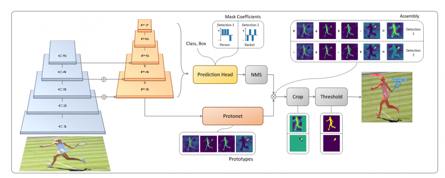

## Dataset
In their research paper, they used COCO dataset for training and testing. I couldn’t train their model with my own dataset because this couldn’t train on Google Colab. Colab times out and resets if I leave it training too long. So I test with my own dataset(collected from Google) with their pre-trained model.
### Imput Images
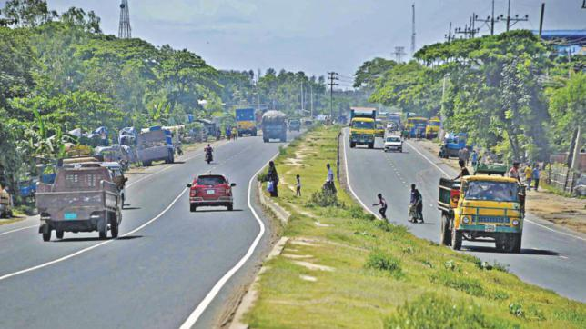
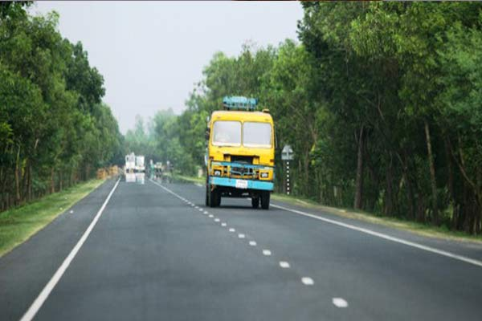

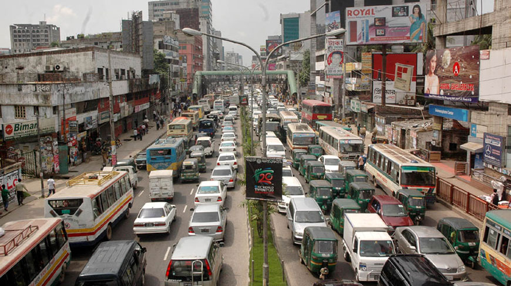

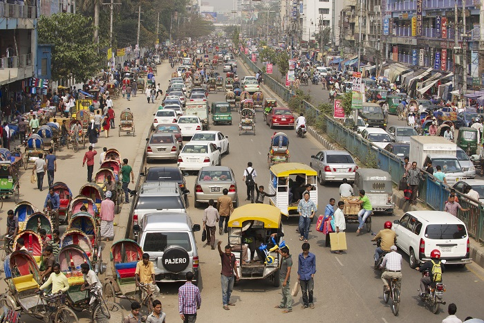
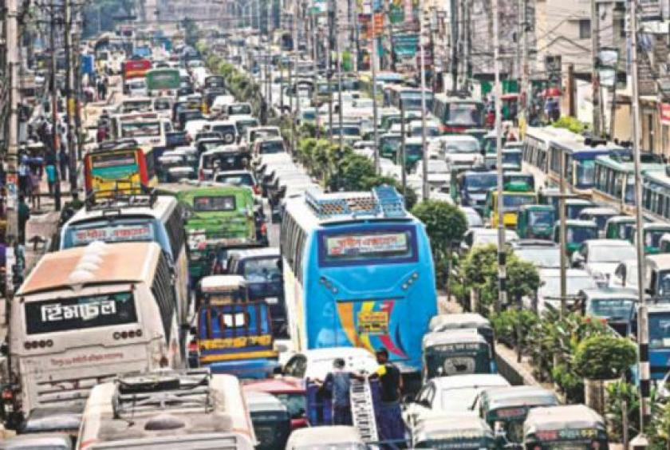
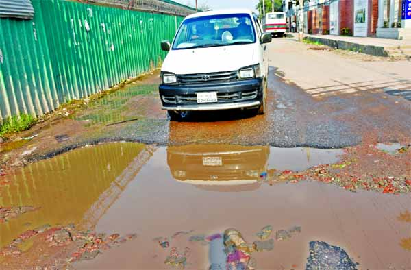
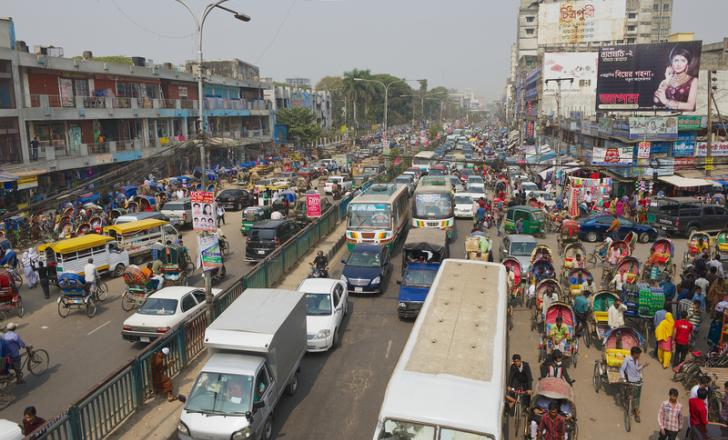
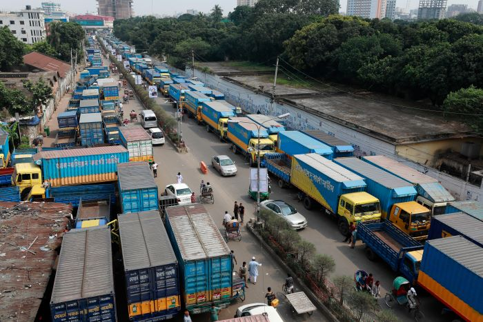

## Methodology
While working on this project, I was inspired from Adam Kelly who made a Google Colab notebook for YOLACT++[3]. First I did the runtime setup in the Google Colab. Then I install some Python libraries. Google Colab probably has these requirements already, but better to include them than to break later. After that I Clone YOLACT repository of Daniel Bolya from GitHub[2]. The DCNv2 external library is needed for this to work, so I built it then. In order to run inference, I needed some pre-trained weights(ResNet 50). The creator of the GitHub repo shared them on Google Drive. I used a helpful tool made by chentinghao to easily access the Drive file from Colab[4]. Then I tested it with my dataset and show the output of the images.
### Output Images

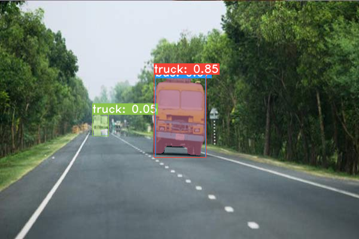
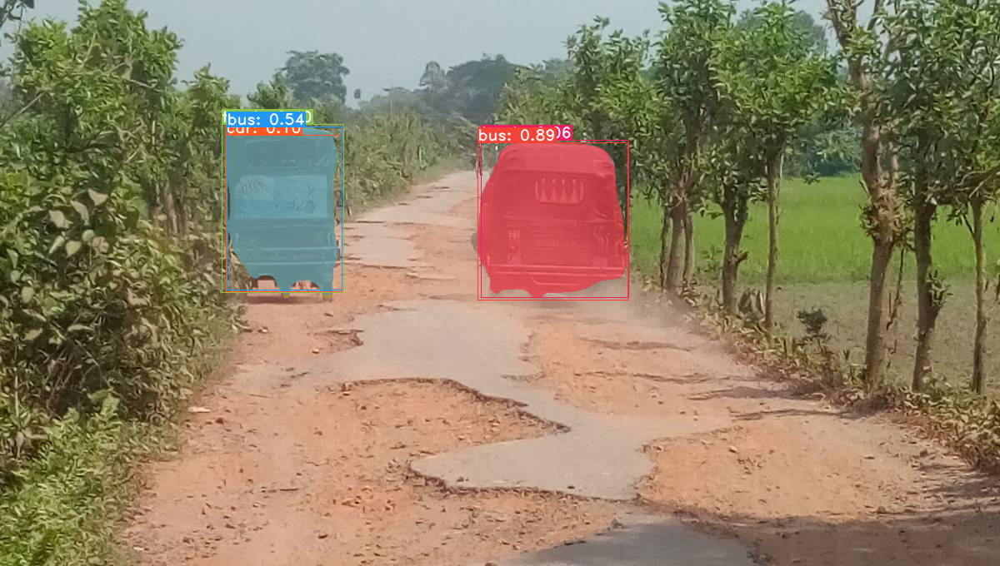
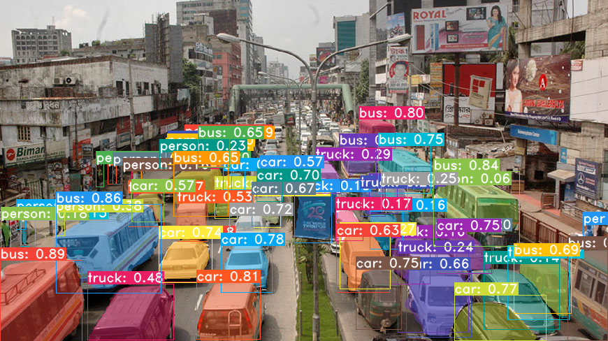
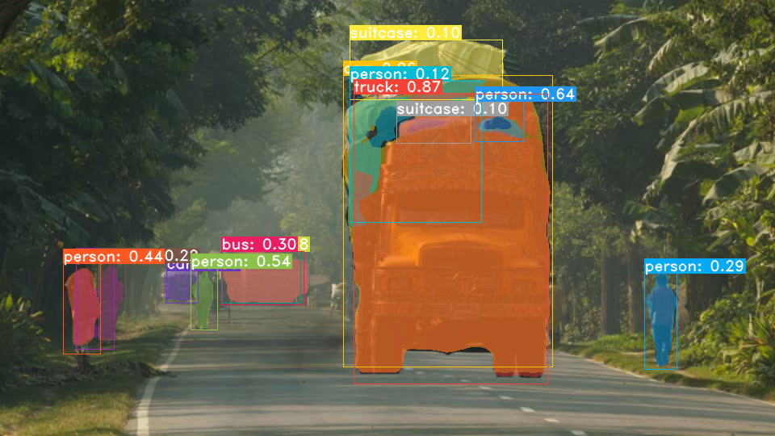

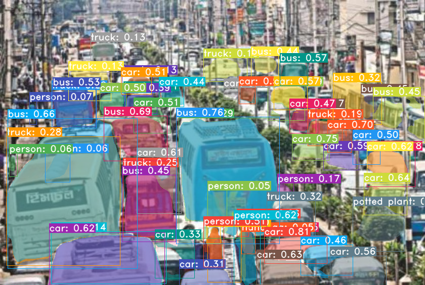
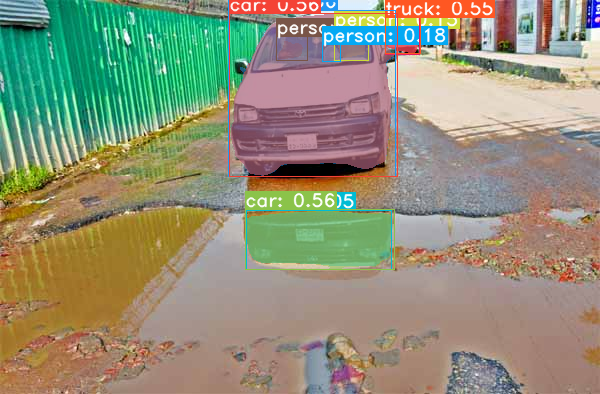
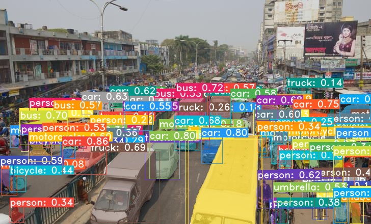
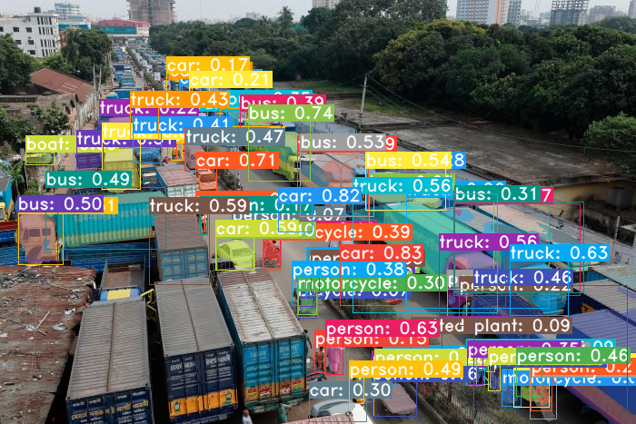

## Results and discussion
The results are quite good. It was fast too. I can also play with the threshold value to segment the images. But, there are some false segmentation also as I could not trained it with my own weights to detect images of roads from Bangladesh. On the other hand, in their build in model, they can only segment 80 different category. So, their pre-trained model just segmented people, cars, buses, trucks etc. but not the roads.

## Conclusions and recommendations
Road image segmentation is a very important topic in many cases. It can be used in autonomous driving. YOLACT++can plays an important role there. It is fast and efficient for instant segmentation. Not only image segmentation, it perfoms good result for video object segmentation also. I will definitely look more details of it. 

## References
* [1] [YOLACT++: Better Real-time Instance Segmentation](https://arxiv.org/abs/1912.06218)
* [2] [GitHub repo of dbolya](https://github.com/dbolya/yolact)
* [3] [Adam Kelly Google Colab Notebook](https://colab.research.google.com/drive/1ncRxvmNR-iTtQCscj2UFSGV8ZQX_LN0M#scrollTo=YWzKi-xiGX-i)
* [4] [GitHub repo of chentinghao](https://github.com/chentinghao )